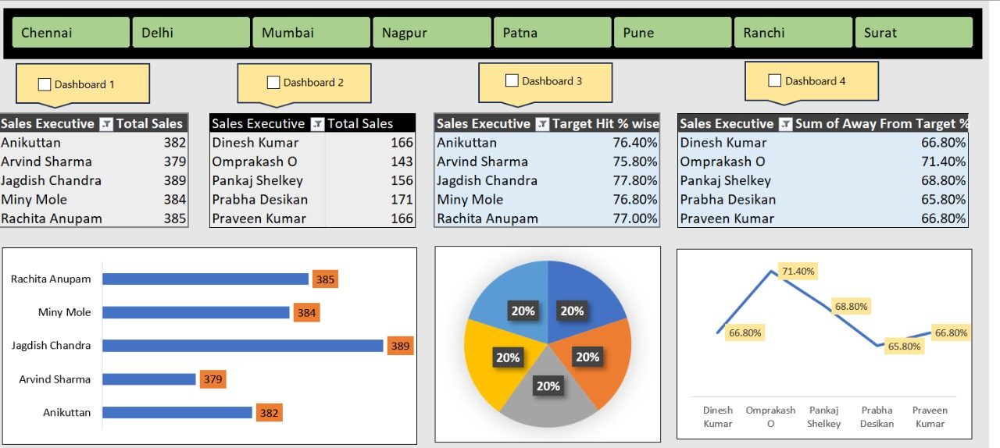

# 📊 Excel Sales Dashboard Project

This project features a fully interactive sales dashboard built using **Microsoft Excel**. It showcases real-time sales performance insights using slicers, checkboxes, and automated macros. The dashboard is ideal for analyzing sales executive performance across cities.

---

## 🔧 Key Features

- ✅ **Dynamic Top 5 and Bottom 5 Executives**
- ✅ **Dashboard Toggle Using Checkboxes (Dashboards 1 to 4)**
- ✅ **Interactive Slicers** for filtering by city
- ✅ **Target Performance Metrics**
  - Target Hit %
  - Away from Target %
- ✅ **Automated Macros** to show/hide dashboards
- 📊 Multiple visualization types: Bar chart, Pie chart, Line chart

---

## 🗂️ Project Structure
excel-sales-dashboard/
├── dashboard/
│ └── SalesDashboard.xlsx # Main Excel dashboard
├── data/
│ └── RawData.xlsx # Source dataset
├── screenshots/
│ └── dashboard_preview.jpg # Dashboard image preview
├── README.md

---

## 🖼️ Dashboard Preview

---

## 🚀 How to Use

1. Download or clone this repository.
2. Open `SalesDashboard.xlsx` in Microsoft Excel (Desktop version).
3. Enable **Macros** and **ActiveX Controls** when prompted.
4. Use:
   - ✅ Checkboxes to switch between dashboards
   - 🔄 Slicers to filter city-based performance
5. View dynamic insights on top/bottom performers and target metrics.

---

## 📈 Data & Analysis

- **RawData.xlsx** contains the base data for all calculations.
- Data is ranked and filtered using formulas and PivotTables.
- Macros automate visibility and layout control of dashboards.

---

## 📌 Notes

- Macros must be enabled to ensure full interactivity.
- The dashboard is optimized for desktop Excel only (not online/mobile).

---

## 👩‍💻 Created By

**Jeedipalli Sravani**  
Aspiring Data Analyst | Excel & Data Visualization Enthusiast  
[LinkedIn Profile](https://www.linkedin.com/in/jeedipalli-sravani)

---

## ⭐ If you find this useful, give this project a star on GitHub!

